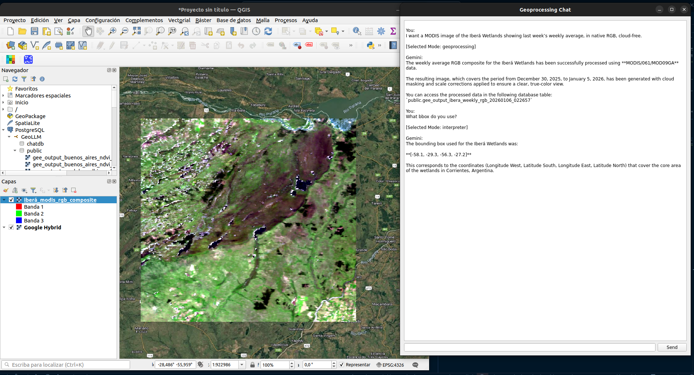
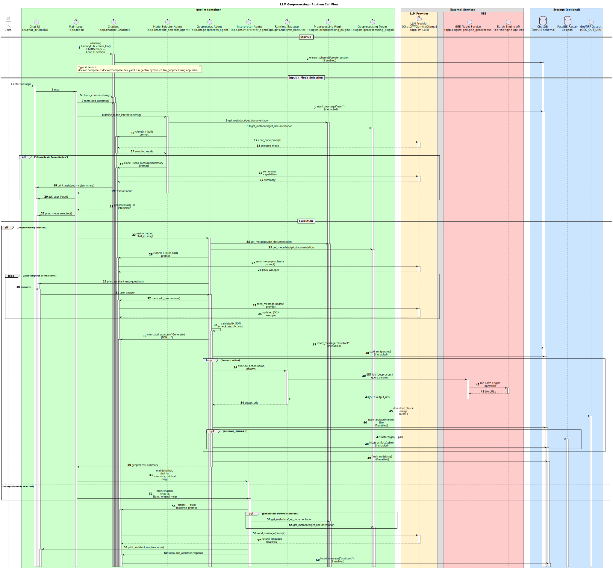

# LLM Geoprocessing

This project is an LLM-driven geoprocessing app that turns chat requests into spatial workflows.
It uses a FastAPI Google Earth Engine (GEE) microservice to run geoprocesses and export GeoTIFF tiles.
Outputs are written to a shared host folder and can be uploaded to PostGIS when enabled.
A Qt/X11 GUI mode is available for interactive use in supported environments.
The Docker Compose stack includes three services: geollm (chat app), gee (GEE service), and postgis (optional).



## Key features

- Interactive chat modes for geoprocessing and interpreter workflows
- FastAPI GEE plugin service for Earth Engine operations
- GeoTIFF tile export to ./gee_out
- Optional PostGIS upload target, logging, and messages history with id per session and id per object (output, log, message)
- Supports multiple LLM providers

## What it can do

- Execute geoprocesses exposed by a plugin service (LLM-driven JSON contract)
- Current plugin: GEE (early-stage, limited geoprocess catalog)
  - It can calculate:
    - Band exports for a single date
    - Band composites over a date range
    - RGB exports for a single date
    - RGB composites over a date range
    - Normalized difference index for a single date
    - Normalized difference index composites over a date range
  - Each one have the option to:
    - Use defaults resolution (meters/degree/number) and projection (CRS) or reproject to a target CRS and resolution.
    - Apply cloud masking (when supported by the product)
    - Request raw or scaled values via scale and offset
    - Specify bands (bands endpoints allow 1..N but RGB requires 3)
    - Choose reducers for composites (mean/median/min/max/mosaic or equivalent in spanish)
    - Provide ND band pairs for index endpoints
    - Control maximum tiles to download with `max_tiles` parameter (need to tell to the LLM the specific parameter and value limits to use it properly, otherwise, it will use the default value).
- Swap in other plugins to target different geospatial data/engines (customizable per business)
- Orchestrate outputs (tiles -> merged GeoTIFF to `./gee_out`, optional PostGIS upload, or custom post-processing)
- Read documentation and metadata from the plugin service to inform LLM decisions. Currently, it reads the whole documentation. Future versions may improve this with RAG techniques.
- A geoprocess can be a general process (not limited to geospatial data), but in the code it’s referred to as "geoprocesses" for convenience.
- Use different LLM providers (Gemini, OpenAI, Ollama) via a common interface
- Run in GUI mode (Qt/X11) or headless (CLI)

## What it cannot do

- Interpret raw geospatial data directly with Computer Vision (requires a multimodal model/plugin, not implemented yet)
- Interpret raw geospatial data directly with raw file access (not implemented yet, but feasible with RAG techniques for vector data)
- Execute SQL or Python code without a dedicated plugin (not provided yet, but feasible if dedicated plugins are built)
- Execute geoprocesses (or other general processing) outside the plugin service (not implemented yet, and not a good idea to implement if the key value is executing well-defined geoprocesses in a controlled environment).

## Requirements

- Docker + Docker Compose
- Optional: Linux with X11 if using the GUI
- Optional: `gcloud` CLI for the GEE plugin service account setup (not required for the framework). See `docs/DEVELOPMENT.md` for details.
- Optional: Ollama on the host if you want to run OLLAMA models. Install guide: https://ollama.com/download

## Quickstart (happy path)

1) Copy `.env.example` to `.env`.
2) Set `GEO_LLM_PROVIDER` (`chatgpt`, `gemini`, or `ollama`) and optionally `GEO_LLM_MODEL`.
3) Set the matching provider credentials in `.env`:
   - Gemini: `GEMINI_API_KEY` (or `GOOGLE_API_KEY`)
   - OpenAI: `OPENAI_API_KEY`
   - Ollama: `OLLAMA_MODEL` (and `OLLAMA_BASE_URL` if not local)
4) Optional: Ensure `./secrets/gee-sa.json` exists (see `docs/DEVELOPMENT.md`), for the GEE plugin to work.

Generate it with the helper script if needed:

```bash
bash secrets/create_gee-sa.sh
```
5) Start the app:

```bash
docker compose -f docker/compose.dev.yaml run --rm --build geollm python -m llm_geoprocessing.app.main
```

If the services are started, the GEE FastAPI docs are at http://localhost:8000/docs.

## Optional for gee plugin
### Generate gee-sa.json (helper script)
The helper script uses `gcloud` to create a service account key. Replace `<PROJECT_ID>` in the script before running it.

```bash
cd secrets
bash create_gee-sa.sh
```

### Requeriments for create_gee-sa.sh

- `gcloud` CLI installed and authenticated (`gcloud auth login`).
  - Install guide: https://cloud.google.com/sdk/docs/install
- An existing Google Cloud project with billing enabled.
  - Project creation guide: https://cloud.google.com/resource-manager/docs/creating-managing-projects
- Earth Engine API enabled for that project.
  - Enable APIs guide: https://cloud.google.com/endpoints/docs/openapi/enable-api
- Permissions to create service accounts and keys in the project.
  - Earth Engine service account guide: https://developers.google.com/earth-engine/guides/service_account?hl=es-419#set-up-rest-api-access

This produces `./secrets/gee-sa.json` (because the script writes `./gee-sa.json` in the current directory).

## Common commands (copy/paste)

Start supporting services (gee + postgis) in background:

```bash
docker compose -f docker/compose.dev.yaml up -d gee postgis
```

Tail gee logs:

```bash
docker compose -f docker/compose.dev.yaml logs --no-log-prefix -f gee
```

Stop stack:

```bash
docker compose -f docker/compose.dev.yaml down
```

## Configuration (essentials)

### From file `.env` (Copy `.env.example` and edit as needed):

- Select LLM provider and model:
  - `GEO_LLM_PROVIDER`: Select LLM provider (`chatgpt` for OpenAI, `gemini`, or `ollama`).
  - `GEO_LLM_MODEL`: Optional model name for the selected provider.
- API keys:
  - `GEMINI_API_KEY`: Gemini API key for LLM access (needed only if using Gemini). Get a key: https://aistudio.google.com/app/apikey
  - `OPENAI_API_KEY`: OpenAI API key for LLM access (needed only if using OpenAI). Get a key: https://platform.openai.com/api-keys
- For Ollama:
  - `OLLAMA_MODEL`: Ollama model name (required if using Ollama).
  - `OLLAMA_BASE_URL`: Ollama API base URL. Default: `http://localhost:11434`.
  - `OLLAMA_NUM_CTX`: Context window for Ollama requests (optional).
  - `OMP_NUM_THREADS`: CPU threads for Ollama runtime (optional).
  - `OLLAMA_NUM_GPU_LAYERS`: GPU offload layers for Ollama (optional).
- For PostGIS:
  - `POSTGIS_ENABLED`: Enable PostGIS upload when set to true. Default: true.
  - `POSTGIS_HOST`: PostGIS hostname. Default: localhost.
  - `POSTGIS_PORT`: PostGIS port. Default: 5432.
  - `POSTGIS_DB`: PostGIS database name. Default: geollm.
  - `POSTGIS_USER`: PostGIS user. Default: geollm.
  - `POSTGIS_PASSWORD`: PostGIS password. Default: geollm.
  - `POSTGIS_SCHEMA`: Target schema for uploads. Default: public.
  - `POSTGIS_TABLE_PREFIX`: Prefix for created tables. Default: gee_output_

### From file `docker/compose.dev.yaml` (Defaults values can be changed here, but there is no need to edit it for basic use):

- `EE_PRIVATE_KEY_PATH`: Path to the Earth Engine service account JSON inside the gee container.
- `GEE_PLUGIN_URL`: Override URL for the GEE FastAPI service if needed.
- `GEO_OUT_DIR`: Container output directory (default `/gee_out`).

For details beyond this overview, see `docs/DEVELOPMENT.md`.

## Outputs

Results are written to `./gee_out` on the host (mounted as `/gee_out` in containers).
The GEE service produces tiled GeoTIFF outputs.

The PostGIS is accessible at `localhost:5432` with the credentials in `.env` if enabled.

## Troubleshooting

- Missing Earth Engine credentials: see `docs/DEVELOPMENT.md`.
- GUI/X11 DISPLAY issues: see `docs/DEVELOPMENT.md`.
- PostGIS connection failures: see `docs/DEVELOPMENT.md`.

## Known CRS issues and QGIS workaround

- MODIS sinusoidal tiles may require a custom CRS in QGIS. Use this as custom CRS (Format: Proj4):

```text
+proj=sinu +lon_0=0 +x_0=0 +y_0=0 +R=6371007.181 +units=m +no_defs
```

- The geoprocess agent also attempts an automatic GDAL SRS fix for MODIS sinusoidal rasters, but only works for the file in disk, not for PostGIS uploads.

## Development documentation

The GEE plugin is the default implementation, intentionally generic, and designed to be swapped into other implementations; see `docs/DEVELOPMENT.md`.
Architecture, JSON contract, plugin API details, testing, and extending geoprocesses are documented in `docs/DEVELOPMENT.md`.

### UML sequence diagram
The UML sequence diagram below summarizes the end-to-end flow described above but with the actual implementation components (classes, modules, and services), and was generated with PlantUML from `docs/uml/UML_sequence_diagram.puml`.

Future TIP: Each time I call a "summary", in the feature they can be the implementation of RAG (Retrieval-Augmented Generation) where the LLM can access a vector DB and retrieve relevant parts of the documents to improve the answers. Also, is possible to implement RAG in each call for "preprocessing plugin" and "geoprocessing plugin" to retrieve relevant metadata and geoprocess documentation.

UML sequence diagram svg:


For more details, see `docs/DEVELOPMENT.md`.

## License

See `LICENSE.txt`.
