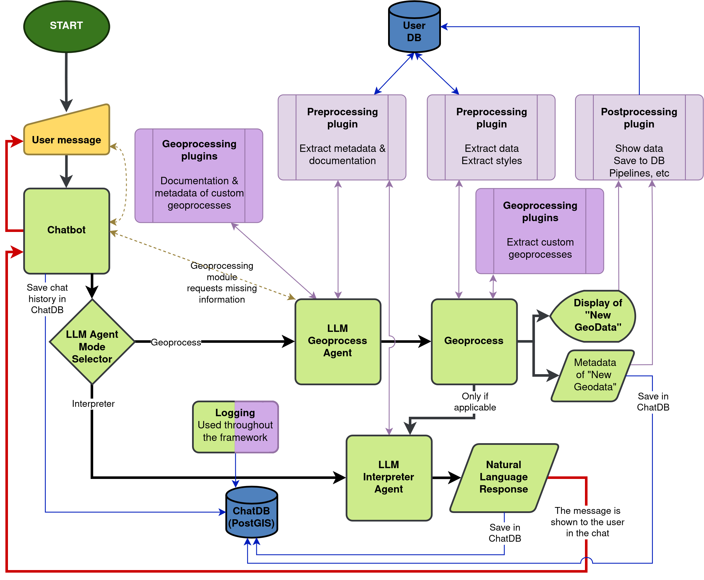

# Development Guide

Dev-only reference for contributors/maintainers. It captures architecture, JSON contract, plugin behavior, and workflows intentionally omitted from README.

Table of contents:
- [1) Dev quickstart](#1-dev-quickstart)
- [2) Repo layout (codebase tour)](#2-repo-layout-codebase-tour)
- [3) Architecture overview](#3-architecture-overview)
- [4) Runtime flows (end-to-end)](#4-runtime-flows-end-to-end)
- [5) Configuration reference (complete, dev-oriented)](#5-configuration-reference-complete-dev-oriented)
- [6) Docker & networking notes](#6-docker--networking-notes)
- [7) Earth Engine authentication (service account)](#7-earth-engine-authentication-service-account)
- [8) GEE plugin (FastAPI) details](#8-gee-plugin-fastapi-details)
- [9) JSON instruction contract (authoritative)](#9-json-instruction-contract-authoritative)
- [10) PostGIS integration](#10-postgis-integration)
- [11) Testing](#11-testing)
- [12) Debugging & logging](#12-debugging--logging)
- [13) Extending the system (adding a new geoprocess)](#13-extending-the-system-adding-a-new-geoprocess)
- [14) LLM providers (Gemini/OpenAI/Ollama)](#14-llm-providers-geminiopenaiollama)
- [15) GUI / Qt development notes](#15-gui--qt-development-notes)
- [16) Plugin replacement and multi-plugin notes](#16-plugin-replacement-and-multi-plugin-notes)

## 1) Dev quickstart

### Build images
Build the dev images (geollm + gee). PostGIS uses a prebuilt image.

```bash
docker compose -f docker/compose.dev.yaml build geollm gee
```

### Start services
Bring up supporting services used by the app.

```bash
docker compose -f docker/compose.dev.yaml up -d gee postgis
```

### Run main app
Run the interactive app container (CLI or GUI depending on ChatIO config).

```bash
docker compose -f docker/compose.dev.yaml run --rm --build geollm python -m llm_geoprocessing.app.main
```

### Stop stack
Stop and remove containers.

```bash
docker compose -f docker/compose.dev.yaml down
```

### Reset volumes/data
PostGIS data persists in `./.data/postgis` via a bind mount. Remove it to reset the DB.

```bash
docker compose -f docker/compose.dev.yaml down
rm -rf ./.data/postgis
```

## 2) Repo layout (codebase tour)

- `docker/compose.dev.yaml`: dev Compose stack (geollm + gee + postgis) and mounts/env defaults.
- `docker/Dockerfile.dev`: dev image (Python 3.12, GDAL, Qt/X11 deps, tooling).
- `src/llm_geoprocessing/app/main.py`: entrypoint and main loop (mode selection -> geoprocessing -> interpreter).
- `src/llm_geoprocessing/app/chatbot/chatbot.py`: LLM provider selection and ChatDB wiring.
- `src/llm_geoprocessing/app/llm/*`: LLM clients and agents (mode selector, geoprocessing, interpreter).
- `src/llm_geoprocessing/app/plugins/gee/gee_geoprocess.py`: FastAPI GEE service and geoprocess endpoints.
- `src/llm_geoprocessing/app/plugins/gee/geoprocessing_plugin.py`: LLM-visible geoprocess metadata/docs.
- `src/llm_geoprocessing/app/plugins/gee/runtime_executor.py`: runtime executor and HTTP adaptor to /tif/{geoprocess_name}.
- `src/llm_geoprocessing/app/plugins/runtime_executor.py`: thin wrapper used by geoprocess_agent; delegates to the GEE executor.
- `src/llm_geoprocessing/app/db/postgis_uploader.py`: raster upload via raster2pgsql + psql and table naming.
- `tests/gee_plugins_json_tests/*`: JSON instruction fixtures, test runner, and log output.

### Where to start reading
- `src/llm_geoprocessing/app/main.py` to see the overall app control flow.
- `src/llm_geoprocessing/app/llm/geoprocess_agent.py` for JSON contract validation and execution.
- `src/llm_geoprocessing/app/plugins/gee/runtime_executor.py` and `src/llm_geoprocessing/app/plugins/gee/gee_geoprocess.py` for the GEE call path.

## 3) Architecture overview



(Components in UML incoming)

This system routes every user message through a small orchestration layer and then runs one of two LLM-driven paths:

- **Interpreter path**: produce a natural-language answer (no geoprocess execution).
- **Geoprocess path**: build a structured geoprocess instruction, execute it, persist outputs/metadata, and then (optionally) describe results back to the user.

### End-to-end flow (as in the diagram)

1. **User message → Chatbot**
   - The Chatbot receives the message and **saves chat history in ChatDB (PostGIS)**.
2. **Mode selection (LLM Agent Mode Selector)**
   - The Chatbot calls the **LLM Agent Mode Selector** (`mode_selection_agent.py`) to decide the path.
   - If **Geoprocess** → go to the Geoprocess path.
   - If **Interpreter** → go to the Interpreter path.
3. **Interpreter path**
   - **LLM Interpreter Agent** generates the **Natural Language Response**.
   - The response is **saved in ChatDB** and **shown to the user**.
4. **Geoprocess path**
   - **LLM Geoprocess Agent** builds the geoprocess instruction (JSON) using plugin-provided context.
   - If required inputs are missing, the **Geoprocessing module requests missing information** via the Chatbot.
   - The **Geoprocess** step runs and produces:
     - **New GeoData** (e.g., GeoTIFFs/tiles/merged outputs)
     - **Metadata of "New GeoData"**
   - Outputs are sent to:
     - **Display of "New GeoData"**
     - **Metadata of "New GeoData"**, which is **saved in ChatDB**
   - **Postprocessing plugin** can also **show data**, **save to DB**, and handle **pipelines**.
   - If applicable, the Geoprocess output is passed to the **LLM Interpreter Agent**.

### Plugin layers (what they contribute)

The plugin system is split by responsibility and is the main source of “grounding” for the LLM agents:

- **Geoprocessing plugins**
  - Provide **documentation & metadata of custom geoprocesses**.
  - **Extract custom geoprocesses** that the LLM Geoprocess Agent can execute.

- **Preprocessing plugin**
  - **Extract metadata & documentation** needed to construct valid instructions.
  - **Extract data** and **extract styles** (resolve datasets, user-selected inputs, visualization/style parameters).
  - These steps interact with the **User DB** to fetch user-scoped assets/preferences.

- **Postprocessing plugin**
  - Responsible for **showing data**, **saving to DB**, and **pipelines, etc**.
  - Also interacts with the **User DB** (user-scoped persistence) and/or ChatDB (run artifacts).

### Persistence and logging

- **ChatDB (PostGIS)** stores:
  - chat history
  - **Logging used throughout the framework**
  - **Metadata of "New GeoData"**
  - (optionally) raster/vector outputs, if you upload results to PostGIS

- **User DB** is the user-scoped store used by preprocessing/postprocessing (datasets, styles, pipelines, preferences), before and after the execution of this framework. It is not part of this project.

### Containers/services mapping

- **geollm**: main interactive app that receives the user message, calls `mode_selection_agent.py`, runs the LLM agents (mode selector / geoprocess / interpreter), executes geoprocess workflows, downloads tiles, merges outputs, and optionally uploads to PostGIS.
- **gee**: FastAPI microservice that runs Earth Engine operations and returns tiled GeoTIFF download URLs.
- **postgis**: optional persistence for ChatDB artifacts and raster outputs (bind-mounted data in `./.data/postgis`).
  - Outputs are written to `./gee_out` on the host (mounted as `/gee_out` in the geollm container).


## 4) Runtime flows (end-to-end)

This section describes the **runtime sequence** that happens inside the components defined in **[3) Architecture overview](#3-architecture-overview)** and adds the **implementation-specific** details (schemas, endpoints, env vars, and debugging points).

### Mode selection flow
- The Chatbot delegates routing to `mode_selection_agent.py`.
- The agent returns the selected path (**Geoprocess** vs **Interpreter**) and the Chatbot dispatches execution accordingly.

### Geoprocessing flow
1) **Preprocessing context**
   - Preprocessing plugins assemble the context required to build a valid instruction:
     - geoprocess docs/metadata
     - data selection + style inputs (may read from the User DB)

2) **Instruction build + validation**
   - The LLM Geoprocess Agent produces the strict JSON wrapper:
     - `json`, `complete`, `questions`
   - The runtime validates the schema before executing.

3) **Clarification loop (only if needed)**
   - If `complete=false` or `questions` is non-empty, the flow loops back to the user via the Chatbot until the instruction is executable.

4) **Execution**
   - The executor runs each action in order:
     - Product IDs in `input_json.product` are resolved to full product names from `products`.
     - The runtime calls the active geoprocess plugin (HTTP service or module executor).
       - HTTP plugins use the `GET /tif/:geoprocess_name` style endpoint.

5) **Outputs + postprocessing**
   - The geoprocess produces:
     - New GeoData (files/tiles/merged results)
     - Metadata describing the produced GeoData
   - Postprocessing plugins may:
     - display results
     - persist outputs and/or register pipelines (as defined in [3) Architecture overview](#3-architecture-overview))

6) **Hand-off to interpreter**
   - A geoprocess summary (plus key metadata) is passed into the interpreter path to generate the user-facing explanation.

> Persistence (ChatDB/PostGIS) follows [3) Architecture overview](#3-architecture-overview) and is not repeated here.

### Interpreter flow
- The LLM Interpreter Agent generates the natural-language response from:
  - the user request, and
  - (optionally) the geoprocess summary produced above.
- Storage/return behavior follows [3) Architecture overview](#3-architecture-overview).

### What to inspect when it goes wrong
- **Mode selection output**: ensure `mode_selection_agent.py` chooses the intended path.
- **Plugin context**: verify preprocessing loaded expected metadata/data/style context.
- **JSON validation**: check missing keys (`json/complete/questions`), invalid dates, invalid bbox shape, or schema mismatches.
- **Executor / plugin calls**:
  - verify `GEE_PLUGIN_URL`
  - verify endpoint names (`/tif/:geoprocess_name`)
  - verify query params passed to the plugin
- **Postprocessing + persistence**: verify ChatDB logging and optional PostGIS uploads behave as expected.
- **Output staging**:
  - confirm `GEO_OUT_DIR` is writable
  - confirm GDAL tools exist in the runtime
  - confirm outputs appear under the host `./gee_out` (mounted as `/gee_out` in `geollm`)

## 5) Configuration reference (complete, dev-oriented)

### From file `.env` (Copy `.env.example` and edit as needed):

LLM provider keys (geollm):
- `GEMINI_API_KEY`: Purpose: Gemini API auth. Service: geollm. Default: (none). Example: `GEMINI_API_KEY=...`.
- `GOOGLE_API_KEY`: Purpose: fallback key for Gemini. Service: geollm. Default: (none). Example: `GOOGLE_API_KEY=...`.
- `OPENAI_API_KEY`: Purpose: OpenAI auth for ChatGPT. Service: geollm. Default: (none). Example: `OPENAI_API_KEY=...`.

PostGIS and ChatDB (geollm, gee):
- `POSTGIS_ENABLED`: Purpose: enable PostGIS uploads and chatdb logging. Service: geollm and gee. Default: `false`. Example: `POSTGIS_ENABLED=true`.
- `POSTGIS_HOST`: Purpose: PostGIS host name. Service: geollm and gee. Default: `localhost`. Example: `POSTGIS_HOST=postgis`.
- `POSTGIS_PORT`: Purpose: PostGIS port. Service: geollm and gee. Default: `5432`. Example: `POSTGIS_PORT=5432`.
- `POSTGIS_DB`: Purpose: database name. Service: geollm and gee. Default: `geollm`. Example: `POSTGIS_DB=geollm`.
- `POSTGIS_USER`: Purpose: database user. Service: geollm and gee. Default: `geollm`. Example: `POSTGIS_USER=geollm`.
- `POSTGIS_PASSWORD`: Purpose: database password. Service: geollm and gee. Default: `geollm`. Example: `POSTGIS_PASSWORD=geollm`.
- `POSTGIS_SCHEMA`: Purpose: target schema for raster uploads. Service: geollm. Default: `public`. Example: `POSTGIS_SCHEMA=public`.
- `POSTGIS_TABLE_PREFIX`: Purpose: table prefix for uploaded rasters. Service: geollm. Default: `gee_output_`. Example: `POSTGIS_TABLE_PREFIX=gee_output_`.
- `CHATDB_ENABLED`: Purpose: enable chat/run logging tables in PostGIS. Service: geollm and gee. Default: follows `POSTGIS_ENABLED`. Example: `CHATDB_ENABLED=true`.

Note: `docker/compose.dev.yaml` sets container defaults for several PostGIS vars; update it if you want those values to differ from `.env`.

### From file `docker/compose.dev.yaml` (edit service `environment:`)

GEE plugin and outputs (geollm):
- `GEE_PLUGIN_URL`: Purpose: base URL for the GEE FastAPI service. Service: geollm (and JSON test runner). Default: `http://gee:8000` (compose uses `http://localhost:8000`). Example: `GEE_PLUGIN_URL=http://localhost:8000`.
- `GEO_OUT_DIR`: Purpose: base output directory for tiles/merged GeoTIFFs. Service: geollm. Default: `/tmp`. Example: `GEO_OUT_DIR=/gee_out`.

Earth Engine service (gee):
- `EE_PRIVATE_KEY_PATH`: Purpose: path to service account JSON inside the gee container. Service: gee. Default: `/keys/gee-sa.json`. Example: `EE_PRIVATE_KEY_PATH=/keys/gee-sa.json`.
- `EE_PROJECT`: Purpose: explicit GEE project id to use at initialization. Service: gee. Default: (unset; falls back to the service account `project_id`). Example: `EE_PROJECT=my-ee-project`.

LLM runtime options (geollm):
- `OLLAMA_BASE_URL`: Purpose: base URL for Ollama HTTP API. Service: geollm. Default: `http://localhost:11434`. Example: `OLLAMA_BASE_URL=http://localhost:11434`.
- `OLLAMA_MODEL`: Purpose: model name to request from Ollama. Service: geollm. Default: `gemma3:1b-it-qat`. Example: `OLLAMA_MODEL=gemma3:12b-cloud`.
- `OLLAMA_NUM_CTX`: Purpose: context window for Ollama requests (tokens). Service: geollm. Default: `8192`. Example: `OLLAMA_NUM_CTX=32768`.
- `CONTEXT`: Purpose: fallback for `OLLAMA_NUM_CTX` if that is unset. Service: geollm. Default: (unset). Example: `CONTEXT=8192`.
- `GEOLLM_LOG_LEVEL`: Purpose: log level for geollm (INFO/DEBUG/etc.). Service: geollm. Default: `INFO`. Example: `GEOLLM_LOG_LEVEL=DEBUG`.

GUI (geollm):
- `DISPLAY`: Purpose: X11 display for Qt GUI. Service: geollm. Default: (unset). Example: `DISPLAY=:0`.

Plugin execution override (geollm):
- `ACTIVE_PLUGIN_EXECUTOR`: Purpose: Python module path that exposes `execute_geoprocess(name, params)` for custom executors. Service: geollm. Default: (unset; uses GEE HTTP adaptor). Example: `ACTIVE_PLUGIN_EXECUTOR=llm_geoprocessing.app.plugins.runtime`.

## 6) Docker & networking notes

### Host networking (geollm)
- `geollm` uses `network_mode: host` in `docker/compose.dev.yaml`.
- Inside the container, `localhost:8000` reaches `gee` and `localhost:5432` reaches `postgis`.
- Docker DNS service names (`gee`, `postgis`) are not available to geollm in this mode.

### Cross-platform caveats
- Host networking is Linux-specific; on macOS/Windows it does not behave the same.
- If you remove host networking, set `GEE_PLUGIN_URL=http://gee:8000` and `POSTGIS_HOST=postgis` to use Compose DNS.

### Ports and exposure
- `gee` publishes `8000:8000` (FastAPI docs at `http://localhost:8000/docs`).
- `postgis` publishes `5432:5432` (data in `./.data/postgis`).
- `geollm` is an interactive container and does not publish ports.

## 7) Earth Engine authentication (service account)

- Host path: `./secrets/gee-sa.json`
- Container path (gee): `/keys/gee-sa.json`
- Env: `EE_PRIVATE_KEY_PATH=/keys/gee-sa.json`

### Generate gee-sa.json (helper script)
The helper script uses `gcloud` to create a service account key. Replace `<PROJECT_ID>` in the script before running it.

```bash
cd secrets
bash create_gee-sa.sh
```

#### Requeriments for create_gee-sa.sh:

- `gcloud` CLI installed and authenticated (`gcloud auth login`).
  - Install guide: https://cloud.google.com/sdk/docs/install
- An existing Google Cloud project with billing enabled.
  - Project creation guide: https://cloud.google.com/resource-manager/docs/creating-managing-projects
- Earth Engine API enabled for that project.
  - Enable APIs guide: https://cloud.google.com/endpoints/docs/openapi/enable-api
- Permissions to create service accounts and keys in the project.
  - Earth Engine service account guide: https://developers.google.com/earth-engine/guides/service_account?hl=es-419#set-up-rest-api-access

This produces `./secrets/gee-sa.json` (because the script writes `./gee-sa.json` in the current directory).

### Initialization behavior
- On startup, `gee_geoprocess.py` checks `EE_PRIVATE_KEY_PATH`.
- If the file exists, it initializes EE with service account credentials and uses `EE_PROJECT` (or the JSON `project_id`).
- If the file does not exist, it calls `ee.Initialize()` and expects the container to be pre-authorized.

### Verify the mount

```bash
docker compose -f docker/compose.dev.yaml exec gee ls -l /keys/gee-sa.json
```

### Common errors and fixes
- `FileNotFoundError` or `EEException: Service account key file not found`:
  - Fix: place the JSON at `./secrets/gee-sa.json` and restart `gee`.
- `EEException: Not authorized` or 403 errors:
  - Fix: ensure the service account has Earth Engine access and set `EE_PROJECT` if required.
- `Invalid JSON` or `Could not parse credentials`:
  - Fix: replace the file with a valid service account JSON.

## 8) GEE plugin (FastAPI) details

### Where it runs
- Service: `gee` in `docker/compose.dev.yaml` (port 8000).
- Docs: http://localhost:8000/docs

### Endpoint convention
- All geoprocesses are exposed as GET endpoints: `/tif/{geoprocess_name}`.
- The runtime executor calls these endpoints by convention and passes `input_json` as query params.

### Geoprocess catalog

#### rgb_single
Purpose: single-date RGB GeoTIFF tiles (3 bands) for a given product and bbox.
Required inputs:
- `product`: GEE image or collection id.
- `bands`: comma-separated 3 bands in RGB order.
- `bbox`: `xmin,ymin,xmax,ymax` (lon/lat).
- `date`: `YYYY-MM-DD`.
Optional inputs:
- `resolution`: number (meters per pixel) or `default`.
- `projection`: CRS string (e.g., `EPSG:4326`) or `default`.
- `tile_size`: pixels, default `1360`.
- `max_tiles`: default `25`.
- `apply_cloud_mask`: default `false`.
- `apply_scale_offset`: default `false`.
Output:
- JSON with `tiling` metadata and `tiles` array of `{row,col,bbox_crs,url}`.

#### rgb_composite
Purpose: multi-date RGB composite tiles using a reducer (cloud reduction / seasonal composites).
Required inputs:
- `product`, `bands`, `bbox`.
- `start`: `YYYY-MM-DD` (inclusive).
- `end`: `YYYY-MM-DD` (inclusive; service adds +1 day internally).
- `reducer`: `mean|median|min|max|mosaic`.
Optional inputs:
- `resolution`, `projection`.
- `tile_size` default `1360`, `max_tiles` default `25`.
- `apply_cloud_mask`, `apply_scale_offset`.
Output:
- Same tiled response as `rgb_single`.

#### index_single
Purpose: single-date normalized difference (ND) GeoTIFF tiles.
Required inputs:
- `product`: GEE image or collection id.
- `band1`, `band2`: ND numerator/denominator bands.
- `bbox` and `date`.
Optional inputs:
- `palette`: ignored for GeoTIFF output.
- `resolution`, `projection`.
- `tile_size` default `2400`, `max_tiles` default `25`.
- `apply_cloud_mask`.
Output:
- Tiled ND GeoTIFF response (1 band) with `tiling` metadata.

#### index_composite
Purpose: multi-date ND composite tiles using a reducer.
Required inputs:
- `product`, `band1`, `band2`, `bbox`.
- `start`, `end` (inclusive; service adds +1 day internally).
- `reducer`: `mean|median|min|max|mosaic`.
Optional inputs:
- `resolution`, `projection`.
- `tile_size` default `2400`, `max_tiles` default `25`.
- `apply_cloud_mask`.
Output:
- Tiled ND GeoTIFF response (1 band) with `tiling` metadata.

#### bands_single
Purpose: single-date N-band GeoTIFF tiles.
Required inputs:
- `product`, `bbox`, `date`.
Optional inputs:
- `bands`: comma-separated list; empty/`None`/`all` exports all bands.
- `resolution`, `projection`.
- `tile_size` default `1360`, `max_tiles` default `25`.
- `apply_cloud_mask`, `apply_scale_offset`.
Output:
- Tiled N-band GeoTIFF response with `tiling` metadata.

#### bands_composite
Purpose: multi-date N-band composite tiles using a reducer.
Required inputs:
- `product`, `bbox`.
- `start`, `end` (inclusive; service adds +1 day internally).
- `reducer`: `mean|median|min|max|mosaic`.
Optional inputs:
- `bands` (empty/`None`/`all` exports all).
- `resolution`, `projection`.
- `tile_size` default `1360`, `max_tiles` default `25`.
- `apply_cloud_mask`, `apply_scale_offset`.
Output:
- Tiled N-band GeoTIFF response with `tiling` metadata.

### Parameter conventions
- `bbox`: `xmin,ymin,xmax,ymax` in lon/lat; invalid formats return HTTP 400.
- `resolution`: `default` uses the product native nominal scale; otherwise a numeric meters-per-pixel value.
- `projection`: `default` uses product native CRS; otherwise an EPSG string.
- `start`/`end`: `end` is inclusive; the service adds +1 day internally.
- `reducer`: accepts `mean`, `median`, `min`, `max`, `mosaic` (also `avg`, `promedio`, `mediana`, `minimo`, `maximo`, `mosaico`).
- `bands`: for RGB, exactly 3 bands; for bands_* empty/`None`/`all` exports all bands.
- `tile_size`: pixel size of each tile edge; affects tile count and download size.
- `max_tiles`: safety cap; exceeding it returns HTTP 400.
- `apply_cloud_mask`: product-specific masking (S2 SR uses SCL/QA60, Landsat C2 L2 uses QA_PIXEL, MODIS uses `state_1km`).
- `apply_scale_offset`: applies per-band scale/offset for reflectance/temperature; supported by rgb_* and bands_*.

### Limits and tiling behavior
- All endpoints return a tiled response (`tiles` + `tiling` metadata) to avoid EE download limits.
- Default `max_tiles` is `25`; reduce bbox or increase resolution to stay under the cap.
- Tile grid is aligned in the target CRS and returned with `crs_transform` and `bbox_crs` per tile.

## 9) JSON instruction contract (authoritative)

### Wrapper object
The LLM must return a JSON wrapper object with exactly these keys:
- `json`: the instruction payload.
- `complete`: boolean indicating whether all required fields are present.
- `questions`: list of follow-up questions when `complete` is false.

### Inner `json` object
The `json` payload must contain:
- `products`: list of product objects (may be `[]`, but the schema expects a list).
- `actions`: list of action objects (must be non-empty for execution).
- `other_params`: object (required even if empty).

Each product object must include:
- `id`: unique product id (e.g., `A`, `B`).
- `name`: full GEE product path (collection or image id).
- `date`: `{ "initial_date": "YYYY-MM-DD", "end_date": "YYYY-MM-DD" }`.
- `proj`: CRS string or `default`.
- `res`: number or `default`.

Each action object must include:
- `geoprocess_name`: one of the supported geoprocesses.
- `input_json`: parameters for the geoprocess.
- `output_id`: unique id used for file naming and PostGIS table naming.

`input_json` typically includes:
- `product`: a product id from the `products` list (resolved to the full product name at runtime).
- `bbox`: list of 4 numbers `[xmin, ymin, xmax, ymax]` (normalized to CSV for HTTP calls).
- other geoprocess parameters (`bands`, `band1`, `band2`, `date`, `start`, `end`, `resolution`, `projection`, etc.).

`other_params` is required even if empty; current GEE geoprocesses do not use it.

### Worked example: single-date (rgb_single)

```json
{
  "json": {
    "products": [
      {
        "id": "A",
        "name": "COPERNICUS/S2_SR_HARMONIZED",
        "date": { "initial_date": "2025-10-01", "end_date": "2025-10-31" },
        "proj": "EPSG:32720",
        "res": 10
      }
    ],
    "actions": [
      {
        "geoprocess_name": "rgb_single",
        "input_json": {
          "product": "A",
          "bands": "B4,B3,B2",
          "bbox": [-64.3, -31.5, -64.0, -31.3],
          "date": "2025-10-15",
          "resolution": 10,
          "projection": "EPSG:32720",
          "apply_cloud_mask": true,
          "apply_scale_offset": true
        },
        "output_id": "cba_rgb_single_10m"
      }
    ],
    "other_params": {}
  },
  "complete": true,
  "questions": []
}
```

### Worked example: composite (index_composite)

```json
{
  "json": {
    "products": [
      {
        "id": "A",
        "name": "COPERNICUS/S2_SR_HARMONIZED",
        "date": { "initial_date": "2025-10-01", "end_date": "2025-10-31" },
        "proj": "EPSG:32720",
        "res": 10
      }
    ],
    "actions": [
      {
        "geoprocess_name": "index_composite",
        "input_json": {
          "product": "A",
          "band1": "B8A",
          "band2": "B4",
          "bbox": [-64.3, -31.5, -64.0, -31.3],
          "start": "2025-10-01",
          "end": "2025-10-31",
          "resolution": 10,
          "projection": "EPSG:32720",
          "reducer": "median",
          "apply_cloud_mask": true
        },
        "output_id": "cba_index_composite_10m"
      }
    ],
    "other_params": {}
  },
  "complete": true,
  "questions": []
}
```

### Incomplete/questions behavior
- If any required value is missing, set `complete: false` and list precise questions in `questions`.
- The system loops until a valid `complete: true` payload is produced.

### Change mode / iterative refinement
- If a prior JSON exists in the conversation, it is treated as the baseline.
- Only apply the requested changes; keep all other fields exactly as-is.
- Ask questions only when the requested change is ambiguous or missing required values.

## 10) PostGIS integration

### Enabling and connectivity
- Set `POSTGIS_ENABLED=true` to enable raster uploads and ChatDB logging.
- `CHATDB_ENABLED` can override logging behavior (defaults to `POSTGIS_ENABLED`).

### What gets created
- Extensions: `postgis` and `postgis_raster` are created if missing.
- Raster tables: created in `POSTGIS_SCHEMA` with prefix `POSTGIS_TABLE_PREFIX`.
- ChatDB schema: `chatdb.sessions`, `chatdb.messages`, `chatdb.runs`, `chatdb.artifacts`, `chatdb.logs`.

### Table naming
- Base name = `output_id` (or raster filename) -> sanitized to lowercase `a-z0-9_`.
- Final name = `{POSTGIS_TABLE_PREFIX}{safe_base}_{YYYYMMDD_HHMMSS}` (UTC).
- Example: `public.gee_output_ndvi_2024_20240101_120000`.

### Upload mechanism
- geollm downloads/merges GeoTIFFs to `GEO_OUT_DIR/gee_merged`.
- Upload path uses raster2pgsql piped to psql with `POSTGIS_*` env vars.

```bash
raster2pgsql -I -C -M <raster.tif> <schema.table> | psql -v ON_ERROR_STOP=1 -X
```

### Verify uploads

```bash
docker compose -f docker/compose.dev.yaml exec postgis psql -U geollm -d geollm -c "\\dt public.*"
```

```bash
docker compose -f docker/compose.dev.yaml exec postgis psql -U geollm -d geollm -c "SELECT * FROM raster_columns;"
```

```bash
docker compose -f docker/compose.dev.yaml exec postgis psql -U geollm -d geollm -c "SELECT table_schema, table_name FROM information_schema.tables WHERE table_name LIKE 'gee_output_%';"
```

### Known CRS issues and QGIS workaround
- MODIS sinusoidal tiles may require a custom CRS in QGIS. Use:

```text
+proj=sinu +lon_0=0 +x_0=0 +y_0=0 +R=6371007.181 +units=m +no_defs
```

- The geoprocess agent also attempts an automatic GDAL SRS fix for MODIS sinusoidal rasters.

## 11) Testing

### Full JSON test suite

```bash
bash tests/gee_plugins_json_tests/run_json_test.sh
```

This builds images, starts gee, runs each JSON fixture, and writes a log to `tests/gee_plugins_json_tests/gee_plugins_json_tests.log`.

### Single JSON test

```bash
docker compose -f docker/compose.dev.yaml run --rm geollm \
  python -m llm_geoprocessing.app.dev_tests.run_geoprocess_json \
  --file tests/gee_plugins_json_tests/json_instruction_test_Sentinel2-rgb-single.json
```

### Logs
- Suite log: `tests/gee_plugins_json_tests/gee_plugins_json_tests.log`.
- Service logs: use the compose log tail command shown in Debugging.

### Interpreting failures
- "Action '...' failed" indicates a GEE endpoint or executor error; check FastAPI `detail`.
- Errors about tiles/resolution/bbox usually mean invalid query params.
- EE auth errors usually point to missing/invalid `./secrets/gee-sa.json`.

## 12) Debugging & logging

### Log levels
- geollm log level is controlled by `GEOLLM_LOG_LEVEL` (INFO/DEBUG/etc.).

```bash
docker compose -f docker/compose.dev.yaml run --rm --build \
  --env GEOLLM_LOG_LEVEL=DEBUG geollm \
  python -m llm_geoprocessing.app.main
```

### Tail gee logs

```bash
docker compose -f docker/compose.dev.yaml logs --no-log-prefix -f gee
```

### geollm logs
- When run interactively, logs stream in that terminal.
- For multi-pane debugging, use the dashboard script:

```bash
bash dev-dashboard.sh
```

### Common failure modes and fixes
- Missing GDAL tools: ensure you are using the dev image (GDAL is installed there).
- `Too many tiles` from GEE: reduce bbox, increase resolution, or raise `max_tiles`.
- HTTP 4xx from GEE: check bbox format, dates, and product id.
- PostGIS upload failures: verify POSTGIS_* env vars and that `raster2pgsql`/`psql` exist in the container.
- GUI launch failures: verify X11 access and `DISPLAY` (see GUI notes).

## 13) Extending the system (adding a new geoprocess)

### Step-by-step
1) Implement a new FastAPI route in `src/llm_geoprocessing/app/plugins/gee/gee_geoprocess.py` under `/tif/{name}`.
2) Add its metadata/docs in `src/llm_geoprocessing/app/plugins/gee/geoprocessing_plugin.py` so the LLM can select it.
3) Ensure `runtime_executor.py` can call it via `/tif/{name}` (names must match).
4) Add a JSON instruction fixture in `tests/gee_plugins_json_tests/`.
5) Run the JSON test suite.

```bash
bash tests/gee_plugins_json_tests/run_json_test.sh
```

### Checklist of gotchas
- Validate bbox and date inputs; enforce `YYYY-MM-DD`.
- Respect `projection="default"` and `resolution="default"` behavior.
- Use tiling (`tile_size`, `max_tiles`) to avoid EE size limits.
- Return the expected response shape: `{ "tiling": { ... }, "tiles": [ ... ] }`.
- Ensure cloud masking and scale/offset are appropriate for the product.
- Keep `geoprocess_name` consistent across LLM metadata and endpoint path.

### Documenting the new geoprocess here
- Add a new entry in Section 8 (GEE plugin details).
- Update JSON contract examples in Section 9 if the new process introduces new inputs.

## 14) LLM providers (Gemini/OpenAI/Ollama)

### How selection works
- The active provider is chosen in `src/llm_geoprocessing/app/chatbot/chatbot.py` by instantiating `Gemini`, `ChatGPT`, or `Ollama`.
- Only one provider is active at a time; selection is not driven by env vars.

### Where to change it
- Edit `Chatbot.__init__` in `src/llm_geoprocessing/app/chatbot/chatbot.py` to switch which class is used.
- Call the provider's `config_api(...)` to set model and tuning.

### Required env vars per provider
- Gemini: `GEMINI_API_KEY` or `GOOGLE_API_KEY`. Get a key: https://aistudio.google.com/app/apikey
- OpenAI: `OPENAI_API_KEY`. Get a key: https://platform.openai.com/api-keys
- Ollama: `OLLAMA_MODEL` (obligatory if using Ollama), `OLLAMA_NUM_CTX` or `CONTEXT` (optional), `OLLAMA_BASE_URL` (optional).

### Ollama host expectation
- By default, `OLLAMA_BASE_URL` points to `http://localhost:11434`, and `geollm` runs with host networking.
- That means Ollama is expected to be running on the host unless you override `OLLAMA_BASE_URL` to another reachable endpoint.

### Ollama host requirements (optional)
- Required only if you want to run Ollama models.
- Install Ollama on the host and ensure the daemon is running.
- Installation guide: https://ollama.com/download
- Download desired models (e.g., `gemma3:27b`) and edit `OLLAMA_MODEL` accordingly. Recommended update also `OLLAMA_NUM_CTX` to have the same context window as the model supports.
- To verify installation, chat with the model from the host terminal:

```bash
ollama run gemma3:27b
```

### Common issues
- Missing API key -> `LLMConfigError` on startup.
- `openai` or `google-genai` SDK import errors -> ensure dependencies are installed in the dev image.
- Ollama connection errors -> verify the Ollama server is running and `OLLAMA_BASE_URL` is correct.
- Model not found -> ensure the model is available for the selected provider.

## 15) GUI / Qt development notes

### Linux X11 setup
- Ensure an X11 server is running on the host and `DISPLAY` is exported.
- Allow local Docker connections before running the container:

```bash
xhost +local:
```

- The compose file mounts `/tmp/.X11-unix` and passes `DISPLAY` into `geollm`.

### GUI code location
- GUI/CLI I/O lives in `src/cli/chat_io.py` (PyQt5 UI plus a patched send loop).

### Running GUI mode
- `src/llm_geoprocessing/app/main.py` creates `ChatIO(..., use_gui=True)` by default.
- Set `use_gui=False` for CLI-only mode when running headless.
- The dev image sets Qt/X11 and software rendering envs (e.g., `QT_X11_NO_MITSHM=1`, `QT_QPA_PLATFORM=xcb`, `LIBGL_ALWAYS_SOFTWARE=1`).

### Common GUI/X11 errors
- `Could not connect to display` -> check `DISPLAY` and re-run the X11 authorization command on the host.
- Qt plugin errors -> confirm X11 libs are present (dev image includes them).

## 16) Plugin replacement and multi-plugin notes

### How the current plugin is wired
- `src/llm_geoprocessing/app/plugins/preprocessing_plugin.py` and `src/llm_geoprocessing/app/plugins/geoprocessing_plugin.py` are thin delegates to `src/llm_geoprocessing/app/plugins/gee/*`.
- `src/llm_geoprocessing/app/plugins/runtime_executor.py` delegates to `src/llm_geoprocessing/app/plugins/gee/runtime_executor.py`.
- The GEE runtime executor uses either a Python module (`ACTIVE_PLUGIN_EXECUTOR`) or the HTTP adaptor (`GEE_PLUGIN_URL`).
- `docker/compose.dev.yaml` builds the `gee` service from `src/llm_geoprocessing/app/plugins/gee` and exposes port 8000.

### Replace with another plugin (single-plugin scenario)
1) Implement the plugin itself:
   - HTTP service option: expose `GET /tif/{geoprocess_name}` endpoints.
   - Python module option: provide `execute_geoprocess(name, params) -> dict`.
2) Update LLM-visible metadata and docs:
   - Point `src/llm_geoprocessing/app/plugins/preprocessing_plugin.py` and `src/llm_geoprocessing/app/plugins/geoprocessing_plugin.py` to your plugin metadata/docs.
3) Update execution wiring:
   - If using HTTP, update `docker/compose.dev.yaml` to build/run your plugin container and set `GEE_PLUGIN_URL` to it.
   - If using a module, set `ACTIVE_PLUGIN_EXECUTOR` to your module path and keep/remove the HTTP service as needed.
4) Keep the response contract compatible:
   - HTTP adaptor accepts either `tiles` + `tiling` (tiled outputs) or `url`/`tif_url` (single output).
   - Python executor should return `output_url` or `output_urls`, optionally with `tiling`.

### Multi-plugin scenario (untested)
- The framework assumes a single active geoprocessing plugin (single metadata source + single executor).
- Supporting multiple plugins likely requires: namespacing geoprocess names, a routing layer in the executor, merged capability docs, and JSON contract changes to select a target plugin.
- This is not tested and may require deeper changes across the agents and runtime.
